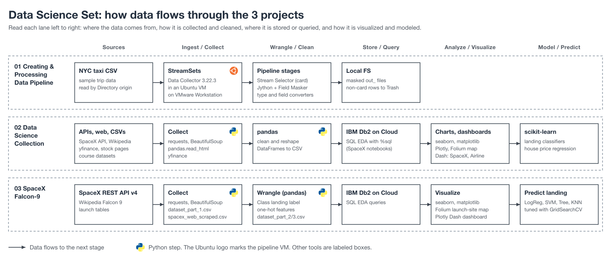

# Data Science Set

Follow-along data science and analytics projects: building a streaming data pipeline, collecting and cleaning data from APIs and web pages, exploring it with SQL, charts, and maps, and training prediction models.

The diagram shows how data moves through each of the 3 projects, from sources and collection through cleaning, SQL queries, charts, and prediction models.

| Section | What you'll build | Folder |
|---|---|---|
| Creating & Processing Data Pipeline | A StreamSets Data Collector pipeline in an Ubuntu VM that masks credit card numbers, converts field types, and adds calculated fields to NYC taxi data | [01-creating-and-processing-data-pipeline](./01-creating-and-processing-data-pipeline/) |
| Data Science Collection | Practice notebooks and Dash dashboards: SpaceX launch data collection and modeling, Tesla and Netflix vs Amazon stock analysis, King County house price regression, and a US airline performance dashboard | [02-data-science-collection](./02-data-science-collection/) |
| SpaceX Falcon-9 | The capstone that predicts whether a Falcon 9 first stage will land, from API and web scraping through SQL, visual EDA, a Folium map, a Dash dashboard, and tuned classifiers | [03-spacex-falcon-9](./03-spacex-falcon-9/) |

## How to use

Each folder is a self-contained project with its own README.md. Open the folder, install what its "What you'll use" section lists, and work through the numbered steps in order. Commands in a section's README run from inside that section's folder.

Notebook output charts are kept inside the `.ipynb` files, and the SpaceX Falcon-9 capstone presentation is summarized in [03-spacex-falcon-9/CAPSTONE-SUMMARY.md](./03-spacex-falcon-9/CAPSTONE-SUMMARY.md).
